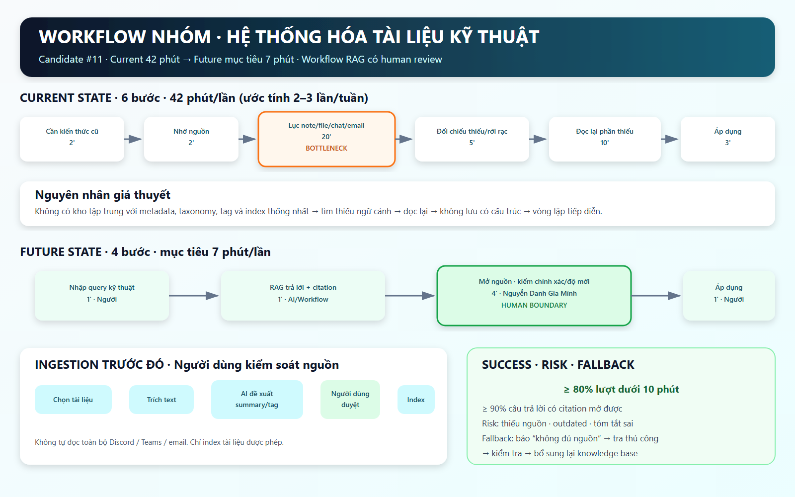

# 02 — Group Problem Statement (Bản nộp nhóm)

> Làm chung 1 bản, mỗi thành viên copy vào repo cá nhân. Đi theo Phase 3 → 6 trong `01-worksheet.md`. Nhóm chỉ chọn **candidate problem** ở Phase 3, viết Problem Statement sau khi validate + vẽ workflow.

## Thành viên nhóm

| STT | Họ và tên | Mã học viên | Vai trò trong nhóm (VD: facilitator, workflow, research, writer) |
|-----|-----------|-------------|---------------------------------------------------------------|
| 1 | Nguyễn Hải Hoàng | 2A202602489 | Chưa phân công |
| 2 | Phan Danh Đạt | 2A202602627 | Chưa phân công |
| 3 | Lê Tuấn Đạt | 2A202602623 | Chưa phân công |
| 4 | Nguyễn Danh Gia Minh | 2A202602441 | Chưa phân công |
| 5 | Hoàng Văn Nam | 2A202602853 | Chưa phân công |

**Candidate problem nhóm chọn (1 câu):**

Người thu thập tài liệu kỹ thuật từ nhiều nguồn chưa có quy trình thống nhất để phân loại, gắn ngữ cảnh và tìm lại đúng tài liệu khi cần sử dụng.
---

## Phase 3 — Group Convergence: từ 15 candidates về 1

### 3.1. Trình bày top 3 mỗi người (mỗi candidate 1-2 phút)

| # | Người đưa ra | Candidate problem | Người gặp vấn đề | Điểm nghẽn | Cảm nhận nhanh của nhóm |
|---|---|---|---|---|---|
| 1 | Nguyễn Hải Hoàng | Tổng hợp báo cáo tuần cho GVHD phải nhớ lại từ đầu, không có bản nháp tích lũy sẵn | Nguyễn Hải Hoàng — người tự tổng hợp và gửi báo cáo tuần | Nhớ lại và biến ghi chú rời rạc thành báo cáo mạch lạc mất khoảng 90 phút/tuần | Impact thời gian và workflow rõ; cần kiểm chứng khả năng duy trì ghi chú hằng ngày vì đây là dependency của input. |
| 2 | Nguyễn Hải Hoàng | Yêu cầu bài tập của giáo viên nằm rải rác trong nhiều đoạn chat Zalo, phải tự lọc thành việc cần làm | Nguyễn Hải Hoàng; có thể cả người học nhận yêu cầu qua Zalo | Đọc và trích yêu cầu từ tin nhắn không cấu trúc, lặp khoảng 3–4 lần/buổi × 5 buổi/tuần | Tần suất cao và bước nghẽn gọn; cần lấy mẫu tin nhắn để kiểm tra mức biến thiên format, quyền truy cập và riêng tư. |
| 3 | Nguyễn Hải Hoàng | Soạn bài nâng cao riêng cho hai học sinh khác khối 4 và 6 sau khi hoàn thành bài tập trên lớp | Nguyễn Hải Hoàng; hai học sinh lớp 4 và lớp 6 | Nghĩ dạng bài đúng chương trình và đúng độ khó cho từng học sinh | Impact dạy học rõ; AI có thể hỗ trợ sinh nội dung nhưng cần teacher review và tiêu chí đo độ khó/chất lượng. |
| 4 | Phan Danh Đạt | Lịch học tuần đầu chương trình AI Thực chiến khóa 4 thay đổi sát giờ so với thông báo các khóa trước, có lớp tối muộn và cuối tuần | Học viên khóa 4 đã sắp xếp lịch cá nhân/công việc; BTC là dependency thông báo lịch | Thay đổi sát giờ sau khai giảng khiến học viên phải sắp xếp lại lịch | Pain có tín hiệu thật nhưng scope chưa rõ: thay đổi một tuần hay kéo dài; cần xác nhận lịch chính thức và số người bị ảnh hưởng. |
| 5 | Phan Danh Đạt | Khối lượng tài liệu nhiều nhưng thời gian đọc trên lớp ít, khó nắm yêu cầu trước khi làm lab | Học viên khóa 4, đặc biệt học viên non-tech | Đọc hiểu thuật ngữ, lọc ý chính và chuyển tài liệu thành yêu cầu thực hiện lab | Actor cần thu hẹp và cần baseline; candidate có thể liên quan onboarding/tóm tắt nhưng chưa rõ bước nào tốn thời gian nhất. |
| 6 | Phan Danh Đạt | Nghẽn ý tưởng khi scan problem thật cho Phase 1 | Phan Danh Đạt trong thời gian làm lab | Nhớ lại trải nghiệm đủ chi tiết để mô tả actor, workflow, bottleneck và evidence | Pain hiện tại và cụ thể, nhưng có thể là bài tập một lần; impact dài hạn và tính lặp lại còn yếu. |
| 7 | Lê Tuấn Đạt | Đọc paper để lấy phần liên quan | Lê Tuấn Đạt/người đang làm nghiên cứu | Dò tìm đoạn liên quan trong paper rồi đọc hiểu để sử dụng | Tốn thời gian và workflow rõ; cần tách thời gian tìm đoạn khỏi thời gian đọc hiểu để xác định đúng bottleneck. |
| 8 | Lê Tuấn Đạt | Gom kết quả train vào bảng so sánh | Lê Tuấn Đạt/người chạy thí nghiệm mô hình | Chép thủ công metric từ nhiều lần train vào bảng, có nguy cơ nhầm số | Evidence và metric trước/sau dễ đo; có khả năng logging convention hoặc script đã đủ, chưa cần AI. |
| 9 | Lê Tuấn Đạt | Tìm lại câu trả lời cũ trong chat nhóm | Thành viên nhóm cần tra cứu quyết định/câu trả lời cũ | Search từ khóa rồi đọc nhiều đoạn chat để tìm đúng ngữ cảnh | Nhiều người có thể cùng đau; cần kiểm tra data access, quyền riêng tư và tần suất tìm thực tế. |
| 10 | Nguyễn Danh Gia Mình | Sắp xếp lịch họp và phòng họp cho cross-team meeting | Người điều phối cross-team meeting; các thành viên tham dự | Tìm giao lịch, phòng trống và xử lý vòng đề xuất lại, mất khoảng 15–20 phút/lần | Actor/workflow/impact tương đối rõ; cần biết có calendar/room API thật hay chỉ có thể giả lập. |
| 11 | Nguyễn Danh Gia Mình | Tài liệu kỹ thuật thu thập từ nhiều nguồn nhưng không được hệ thống hóa | Người thu thập và sử dụng tài liệu kỹ thuật | Phân loại, gắn ngữ cảnh và tìm lại tài liệu từ nhiều nguồn, xảy ra khoảng 2–3 lần/tuần | Có tần suất nhưng workflow còn rộng; cần thu hẹp loại tài liệu, nguồn, output và tình huống sử dụng. |
| 12 | Nguyễn Danh Gia Mình | Viết meeting notes sau cross-team meeting | Người phụ trách ghi biên bản; thành viên cần action items/decisions | Biến ghi chú hoặc nội dung cuộc họp thành notes có cấu trúc, mất khoảng 20–30 phút/buổi | Workflow và metric rõ; feasibility phụ thuộc việc có transcript thật hay chỉ có ghi chú tay. |
| 13 | Hoàng Văn Nam | Báo cáo và đồng bộ tiến độ trên GitHub, Drive, DOCX | Hoàng Văn Nam — sinh viên năm 4 vừa đi làm vừa làm khóa luận; GVHD là người review | Nhập/định dạng lại phần nội dung thực sự bị trùng giữa các kênh | Lặp hằng tuần nhưng chưa chứng minh ba nơi đều bắt buộc hoặc chứa cùng nội dung; process fix có thể giải quyết phần lớn. |
| 14 | Hoàng Văn Nam | Chuyển feedback sau review thành task có thể thực hiện và kiểm tra | Hoàng Văn Nam trong review 1:1 hằng tuần; GVHD xác nhận cách hiểu | Chuyển feedback thành task có vị trí cần sửa và acceptance criteria rõ | Tác động trực tiếp tiến độ khóa luận; cần log 3–5 buổi để kiểm chứng bottleneck, ưu tiên template/process fix trước AI. |
| 15 | Hoàng Văn Nam | Xếp lịch review hằng tuần với GVHD | Hoàng Văn Nam và GVHD | Lọc availability theo lịch làm/lịch dạy, rule online/offline và buffer rồi xác nhận/reschedule | Workflow ngắn, đo được; fixed weekly slot + mặc định online có thể làm problem biến mất mà không cần build. |

### 3.2. Gom trùng / cluster (gom 15 ý thành 4 cụm)

| Cluster | Candidates included | Pattern chung | Ghi chú |
|---|---|---|---|
| A — Báo cáo, ghi chú và chuyển thông tin thành đầu việc | #1 Báo cáo tuần cho GVHD; #12 Meeting notes; #13 Đồng bộ tiến độ đa kênh; #14 Feedback review → task | Biến dữ liệu/ghi chú/feedback rời rạc thành artifact có cấu trúc để người khác review hoặc để tiếp tục thực hiện | #1 và #12 gần nhau ở bước tổng hợp narrative; #14 tập trung acceptance criteria; #13 cần kiểm tra duplication có thật. Nhiều bài có thể bắt đầu bằng template/process fix. |
| B — Tìm kiếm, đọc hiểu và hệ thống hóa thông tin | #2 Lọc yêu cầu từ chat Zalo; #5 Đọc tài liệu để làm lab; #7 Đọc paper lấy phần liên quan; #9 Tìm câu trả lời cũ trong chat; #11 Hệ thống hóa tài liệu kỹ thuật | Tìm đúng thông tin trong nguồn dài/rời rạc, hiểu ngữ cảnh rồi chuyển thành nội dung có thể sử dụng | Cụm lớn nhưng khác nguồn và actor; cần tránh gộp thành “search mọi thứ”. #2/#9 có rủi ro riêng tư, #7 có thể tách retrieval và comprehension, #11 còn rộng. |
| C — Lịch học, lịch họp và coordination | #4 Lịch khóa học thay đổi sát giờ; #10 Xếp lịch/phòng cross-team meeting; #15 Xếp lịch review với GVHD | Phối hợp availability, constraint, thông báo và reschedule giữa nhiều bên | #10 và #15 gần nhau về scheduling; #4 thiên về change communication hơn là tìm slot. Shared calendar/rule có thể đủ; cần baseline và quyền tích hợp thật. |
| D — Dạy học, thí nghiệm và phát triển ý tưởng | #3 Soạn bài nâng cao cho học sinh lớp 4/6; #6 Nghẽn ý tưởng scan problem; #8 Gom kết quả train | Tạo hoặc tổ chức đầu ra chuyên môn từ yêu cầu/dữ liệu đầu vào | Đây là cụm tạm có độ liên kết thấp. #3 cần kiểm soát chất lượng nội dung, #6 có tính một lần, #8 nhiều khả năng là logging/script; nên đánh giá riêng khi shortlist. |

### 3.3. Shortlist (giữ 4 bài để tiếp tục so sánh)

| Candidate | Vì sao vào shortlist (2-3 ý) | Rủi ro / điều chưa rõ |
|---|---|---|
| **#2 — Lọc yêu cầu bài tập từ các đoạn chat Zalo** | Tần suất cao, khoảng 3–4 yêu cầu/buổi × 5 buổi/tuần; actor và workflow tương đối rõ: nhận tin nhắn → đọc/lọc → chuyển thành việc cần làm; bài toán có thể so sánh Rule, Workflow và AI trích xuất văn bản. | Chưa có mẫu chat thật để biết format biến thiên đến mức nào; quyền truy cập Zalo và quyền riêng tư có thể khiến việc tự động lấy dữ liệu không khả thi; cần đo số yêu cầu bị sót và thời gian lọc hiện tại. |
| **#5 — Đọc khối lượng tài liệu lớn để hiểu yêu cầu trước khi làm lab** | Có pain phù hợp với bối cảnh khóa học và có thể ảnh hưởng nhiều học viên, đặc biệt người non-tech; có thể đo thời gian đọc, số thuật ngữ phải tra cứu và số lần hiểu sai yêu cầu; cho phép so sánh tài liệu có cấu trúc/checklist với AI tóm tắt hoặc giải thích. | Actor còn rộng và chưa có số người xác nhận; chưa biết bottleneck chính là khối lượng tài liệu, thuật ngữ chuyên ngành hay thời gian trên lớp; cần xác định loại tài liệu và một output cụ thể thay vì giải quyết “đọc hiểu” nói chung. |
| **#9 — Tìm lại câu trả lời cũ trong chat nhóm** | Có khả năng nhiều thành viên cùng gặp, workflow ngắn và dễ quan sát: nhớ câu hỏi → search từ khóa → đọc thread → xác nhận đúng ngữ cảnh; có thể đo thời gian tìm, tỷ lệ không tìm thấy và số câu hỏi bị hỏi lại; so sánh được FAQ/index, search và AI retrieval. | Chưa có baseline tần suất và số người bị ảnh hưởng; data access, quyền riêng tư và phạm vi lịch sử chat là dependency lớn; câu trả lời cũ có thể đã hết hạn hoặc thiếu ngữ cảnh, cần người xác nhận trước khi tái sử dụng. |
| **#11 — Hệ thống hóa tài liệu kỹ thuật thu thập từ nhiều nguồn** | Xảy ra khoảng 2–3 lần/tuần và có nhu cầu lặp lại; liên quan cùng pattern tìm kiếm nhưng mở rộng sang phân loại, gắn ngữ cảnh và truy xuất lại; có thể so sánh taxonomy/template, rule gắn tag, workflow ingestion và AI hỗ trợ phân loại/tóm tắt. | Problem hiện còn rộng: chưa rõ actor, loại tài liệu, nguồn nào và output mong muốn; chưa xác định bottleneck là lưu, phân loại hay tìm lại; cần thu hẹp thành một workflow 3–7 bước và đo thời gian/tỷ lệ tìm lại trước khi chấm điểm. |

### 3.4. Score để đồng thuận (chấm 1-5, ép nói rõ vì sao cho 5 / cho 3)

| Candidate | Actor rõ | Workflow rõ | Pain có evidence | Impact đo được | Làm trong lab | So sánh R/W/A được | Nhóm hiểu domain | Tổng |
|---|---:|---:|---:|---:|---:|---:|---:|---:|
| **#2 — Lọc yêu cầu bài tập từ chat Zalo** | 4 | 5 | 4 | 4 | 3 | 4 | 4 | **28** |
| **#5 — Đọc tài liệu để hiểu yêu cầu làm lab** | 3 | 3 | 3 | 3 | 5 | 4 | 5 | **26** |
| **#9 — Tìm câu trả lời cũ trong chat nhóm** | 4 | 5 | 3 | 4 | 3 | 5 | 4 | **28** |
| **#11 — Hệ thống hóa tài liệu kỹ thuật từ nhiều nguồn** | 3 | 4 | 4 | 4 | 5 | 5 | 5 | **30** |

**Candidate nhóm chọn (1 bài duy nhất):**

```text
#11 — Hệ thống hóa tài liệu kỹ thuật thu thập từ nhiều nguồn.
```

**Vì sao chọn (4-5 câu):**

```text
#11 đạt 30/35 điểm, cao nhất trong bốn candidate shortlist. Nhóm đều quen với việc thu
thập tài liệu kỹ thuật từ nhiều nguồn nên hiểu domain và có thể dùng mẫu dữ liệu thật
để mô tả workflow trong phạm vi lab. Candidate này cho phép so sánh rõ No AI, taxonomy
hoặc rule gắn tag, workflow nhập liệu và AI hỗ trợ phân loại/tóm tắt; vì vậy nhóm không
bị buộc phải chọn Agent. Tuy nhiên, đây mới là candidate để pitch và deep-dive: nhóm
phải thu hẹp actor, loại tài liệu, nguồn, output và bottleneck trước khi viết Problem Statement.
```

**Vì sao KHÔNG chọn các candidate còn lại (mỗi bài 2-3 câu):**

```text
#2 — Lọc yêu cầu từ chat Zalo: tần suất và workflow rõ, nhưng quyền truy cập dữ liệu,
quyền riêng tư và sự khác nhau trong cách giáo viên nhắn có thể khiến pilot trong lab
phải dùng dữ liệu giả lập. Nhóm giữ đây là phương án dự phòng nếu #11 không thu hẹp được.

#5 — Đọc tài liệu để hiểu yêu cầu làm lab: nhóm hiểu bối cảnh và có thể thử nhanh,
nhưng actor, bottleneck và output hiện còn rộng; “đọc hiểu tốt hơn” khó đo hơn việc lưu,
phân loại và tìm lại một tài liệu cụ thể.

#9 — Tìm câu trả lời cũ trong chat nhóm: workflow ngắn và retrieval metric khá rõ,
nhưng data access, quyền riêng tư và câu trả lời hết hạn tạo rủi ro tương tự #2. Candidate
này cũng thu hẹp vào chat, trong khi #11 cho phép nhóm kiểm tra pattern trên nguồn mà
nhóm có quyền sử dụng trước.
```

**Disagreement (nếu có — ai lo gì, chốt ra sao):**

```text
Chưa có dữ liệu về disagreement giữa các thành viên. Nhóm tạm chốt #11 theo ma trận
điểm; nếu có ý kiến khác, cần ghi tên người nêu, lo ngại cụ thể và cách nhóm xử lý trước
khi nộp bản cuối.
```

---

## Phase 4 — Quick Validation + Research

### 4.1. Quick validation (ít nhất 1 cách: interview 2-3 người hoặc survey 5-10 người)

> **CẢNH BÁO:** Ba mẫu dưới đây là **dữ liệu giả lập để minh họa cách trình bày**, không phải phỏng vấn thật và không được dùng làm bằng chứng khi nộp. Nhóm cần thay bằng câu trả lời và quote nguyên văn của ba người thật.

| Nguồn | Số người / mẫu | Tín hiệu xác nhận (kèm quote nguyên văn) | Tín hiệu phản bác | Nhóm sửa problem thế nào |
|---|---:|---|---|---|
| Phỏng vấn giả lập — Sinh viên năm 4 CNTT làm khóa luận | 1 | Quote minh họa: “Tôi nhớ đã đọc cách đánh giá mô hình trong một paper hoặc notebook cũ, nhưng thường mất 25–35 phút để tìm đúng đoạn và kiểm tra lại ngữ cảnh.” Persona ước tính gặp khoảng 2 lần/tuần; pain tập trung ở bước tìm đúng đoạn trong Drive, GitHub và bookmark. | Paper quan trọng đã được xếp theo thư mục nên đôi khi tìm trong dưới 5 phút; không phải mọi tài liệu đều cần đưa vào knowledge base. | Thu hẹp pilot vào paper, notebook và bookmark do người dùng chủ động chọn; đo cả trường hợp folder/keyword search hiện tại đã tìm nhanh để tránh phóng đại lợi ích RAG. |
| Phỏng vấn giả lập — Lập trình viên backend 1–2 năm kinh nghiệm | 1 | Quote minh họa: “Search từ khóa trả quá nhiều kết quả. Tôi tìm được đoạn chat cũ nhưng vẫn phải mở documentation chính thức để xem thông tin còn đúng không.” Persona ước tính gặp 3 lần/tuần, mất khoảng 15–25 phút/lần. | Pain không chỉ đến từ thiếu index mà còn do tài liệu hết hạn; AI tổng hợp không có ngày cập nhật và nguồn có thể làm tăng rủi ro áp dụng sai. | Bổ sung metadata `source`, `captured_at` và `updated_at` nếu có; bắt buộc citation mở được và human review trước khi áp dụng; không tự index toàn bộ chat riêng tư. |
| Phỏng vấn giả lập — Học viên AI làm việc toàn thời gian | 1 | Quote minh họa: “Tôi lưu link ở nhiều nơi nhưng ít ghi vì sao nó hữu ích. Khi làm lab, tôi phải đọc lại gần như từ đầu để biết phần nào liên quan.” Persona ước tính gặp 2–3 lần/tuần, mất khoảng 30–40 phút/lần. | Nguyên nhân một phần là không duy trì thói quen ghi chú; một kho Notion/Markdown và template đơn giản có thể giải quyết phần lớn pain mà chưa cần AI. | Pilot process fix trước với `topic`, `use case`, `source URL`, ngày và summary ngắn. Chỉ thử semantic retrieval nếu sau khi chuẩn hóa, ít nhất 20% lượt tìm vẫn mất trên 10 phút. |

**Insight sau validation (1-2 câu — pain thật nằm ở đâu):**

```text
Dữ liệu minh họa gợi ý ba failure mode cần kiểm chứng riêng: không tìm thấy đúng đoạn,
tìm thấy nhưng thiếu/hết hạn ngữ cảnh, và không nhớ vì sao tài liệu đã được lưu. Vì đây
chưa phải dữ liệu thật, nhóm chưa được dùng các con số trên làm baseline; cần phỏng vấn
3 người thật và ghi nhật ký 5–10 lượt tra cứu trước khi chốt Problem Statement.
```

Bằng chứng đính kèm (nếu có): `02-group-problem-statement-survey.png`, `...-interview-notes.md`

**Trạng thái validation:** `Chưa hoàn thành — nội dung hiện tại là dữ liệu giả lập, cần thay bằng 3 phỏng vấn thật.`

### 4.2. Research giải pháp đã có (ít nhất 2-3 tools/patterns + 1-2 link kiểm được)

| Nguồn / tool / case | Link | Họ giải quyết bước nào? | Điểm mạnh | Khoảng trống / rủi ro | Bài học cho nhóm |
|---|---|---|---|---|---|
| Google NotebookLM | https://notebooklm.google.com/ | Giải quyết phần index/retrieval/review: tổ chức tập nguồn do người dùng cung cấp, tổng hợp, hỏi đáp và dẫn người dùng trở lại nguồn qua citation. | Pattern source-grounded giúp câu trả lời bám vào tài liệu đã chọn, hỗ trợ tóm tắt và Q&A, đồng thời giảm rủi ro người dùng tin một câu trả lời không có nguồn đối chiếu. | Capture chưa hoàn toàn tự động: người dùng vẫn phải chọn, thêm và quản lý nguồn. Nhóm chưa xác minh được giới hạn `50–100 nguồn` từ link chính thức nên không dùng con số này làm căn cứ thiết kế. | RAG phải luôn trả citation/link tới đoạn hoặc tài liệu gốc để người dùng kiểm tra trước khi áp dụng. |
| Notion AI | https://www.notion.so/product/ai | Giải quyết khâu tổ chức knowledge có cấu trúc, tạo summary/thuộc tính và tìm kiếm trên workspace cùng các ứng dụng được kết nối. | Tích hợp trong docs/database hằng ngày; trang chính thức nêu Enterprise Search trên các nguồn kết nối như Slack, Google Drive và GitHub, cùng khả năng hiển thị nguồn trong AI citations. | Garbage in, garbage out: note sơ sài hoặc thiếu metadata vẫn cho kết quả kém. Connected apps, Enterprise Search và mức sử dụng AI phụ thuộc plan/quyền truy cập; không mặc định truy cập được Discord, email hoặc bookmark cá nhân. | Cần chuẩn hóa ngay khi ingestion bằng template tối thiểu: topic, source URL, ngày, use case, summary và tag đã được người dùng duyệt. |
| Onyx — Open Source AI Platform | https://github.com/onyx-dot-app/onyx | Giải quyết connector ingestion, đồng bộ knowledge và search/RAG tập trung bằng vector + keyword index. | Open source, có thể self-host; bản Standard có connector-sync workers, RAG index và hỗ trợ nhiều LLM. Pattern hybrid retrieval phù hợp khi tài liệu nằm ở nhiều hệ thống. | Full deployment cần nhiều thành phần như worker, indexing/inference, Redis và MinIO; cấu hình connector phụ thuộc API key và permission. Bản Lite nhẹ hơn nhưng không có RAG index và connector-sync workers của Standard, nên giải pháp đầy đủ quá nặng cho pilot cá nhân. | Không tự xây lại Enterprise Search. Chỉ học pattern connector/webhook → kho trung gian → hybrid retrieval, và bắt đầu với một tập nguồn nhỏ được phép sử dụng. |

**Research takeaway (2-3 câu — nên build gì / không build gì):**

```text
Không nên tự viết lại giao diện ghi chú, hệ thống chat hoặc dựng hạ tầng Enterprise
Search như Onyx vì quá cồng kềnh cho nhu cầu của một cá nhân. Nếu validation thật cho
thấy template Notion/Markdown và keyword search chưa đủ, nhóm nên pilot Workflow RAG
tinh gọn: 1-click capture tài liệu được phép → AI đề xuất summary/tag → người dùng duyệt
→ index → semantic search trả kết quả kèm citation theo pattern NotebookLM. Không tự đọc
toàn bộ Discord/Teams/email và không dùng Agent tự chọn nguồn hoặc áp dụng kiến thức.
```

> Lưu ý: không dùng số liệu AI đưa nếu không verify được link chính thức. Ghi rõ giả định chưa chắc.

---

## Phase 5 — Workflow + Problem Statement

### 5.1. Current workflow bản nhóm

Dán workflow hoặc link file: `02-group-problem-statement-workflow.png`



```text
CURRENT STATE — 6 bước, 42 phút/lần (ước tính 2–3 lần/tuần; cần bấm giờ)

[1. Phát sinh nhu cầu: 2' - Nguyễn Danh Gia Mình]
→ [2. Nhớ nguồn đã từng đọc: 2' - Nguyễn Danh Gia Mình]
→ [3. Lục note/file/Discord/Teams/email: 20' - Nguyễn Danh Gia Mình]  <-- bottleneck
→ [4. Đối chiếu và nhận ra thông tin thiếu/rời rạc: 5' - Nguyễn Danh Gia Mình]
→ [5. Đọc/tìm hiểu lại phần còn thiếu: 10' - Nguyễn Danh Gia Mình]
→ [6. Áp dụng vào task nhưng chưa lưu có hệ thống: 3' - Nguyễn Danh Gia Mình]
```

| Bước | Actor | Input | Output | Thời gian / tần suất | Ghi chú (handoff? bottleneck?) |
|---|---|---|---|---|---|
| 1 | Nguyễn Danh Gia Mình | Task cần giải quyết | Chủ đề hoặc kiến thức cần dùng lại được xác định | 2 phút; ước tính 2–3 lần/tuần | Điểm bắt đầu workflow khi gặp vướng mắc kỹ thuật. |
| 2 | Nguyễn Danh Gia Mình | Chủ đề cần tìm | Ký ức sơ bộ về nơi từng đọc | 2 phút/lần | Có thể không nhớ chính xác nguồn hoặc từ khóa. |
| 3 | Nguyễn Danh Gia Mình | Chủ đề và nguồn nhớ được | Một tập note, file, message hoặc email có khả năng liên quan | 20 phút/lần | **Bottleneck:** tìm thủ công trên nhiều kênh không có taxonomy/tag/index chung. |
| 4 | Nguyễn Danh Gia Mình | Các đoạn/tài liệu tìm được | Xác định phần thông tin còn thiếu, rời rạc hoặc cần kiểm tra độ mới | 5 phút/lần | Không phải lần nào cũng tìm được một nguồn đầy đủ và đúng ngữ cảnh. |
| 5 | Nguyễn Danh Gia Mình | Tài liệu cũ và phần thông tin thiếu | Kiến thức được đọc/tổng hợp đủ để xử lý task | 10 phút/lần | Đo riêng để biết đây là hậu quả của retrieval kém hay bottleneck đọc hiểu độc lập. |
| 6 | Nguyễn Danh Gia Mình | Kiến thức vừa tổng hợp | Task được xử lý | 3 phút/lần | Chưa lưu lại theo cấu trúc thống nhất nên workflow có thể lặp lại. |

**Bottleneck chính (2-3 câu):**

```text
Bottleneck chính nằm ở bước 3: tìm thủ công tài liệu trên note, file, Discord, Teams và
email mất khoảng 20 phút nhưng kết quả có thể vẫn rời rạc hoặc thiếu ngữ cảnh. Nguyên
nhân giả thuyết là chưa có một kho tập trung với metadata, tag và index thống nhất; bước
đọc lại 10 phút được đo riêng, không gộp thành bottleneck thứ hai trước khi có baseline thật.
```

### 5.2. Future workflow bản nhóm

Phải nhìn ra 5 thứ: bước nào máy (Rule), bước nào AI, bước nào người, boundary ở đâu, fallback khi AI sai.

```text
FUTURE STATE — 4 bước, mục tiêu 7 phút/lần

[1. Nhập query kỹ thuật: 1' - Nguyễn Danh Gia Mình]
→ [2. Truy vấn RAG, tổng hợp câu trả lời + citation: 1' - AI/Workflow]
→ [3. Mở nguồn, kiểm tra độ chính xác và độ mới: 4' - Nguyễn Danh Gia Mình]
   <-- human boundary
→ [4. Áp dụng kiến thức vào task: 1' - Nguyễn Danh Gia Mình]

Ingestion trước đó: người dùng chọn tài liệu → máy trích text → AI đề xuất summary/tag
→ người dùng duyệt → hệ thống index vào knowledge base.

Fallback: Nếu tài liệu chưa được index, RAG không tìm thấy hoặc citation không mở được,
hệ thống báo “không đủ nguồn”; người dùng quay về tra cứu thủ công và chỉ bổ sung tài
liệu vào knowledge base sau khi kiểm tra.
```

**Before/after impact:**

| Metric | Trước | Sau kỳ vọng | Cách đo |
|---|---:|---:|---|
| Tổng thời gian | 42 phút/lần (ước tính) | 7 phút/lần; dưới 10 phút ở ≥ 80% lượt pilot | Bấm giờ từ lúc phát sinh nhu cầu đến khi tìm được nguồn đủ dùng và áp dụng vào task; lấy 5–10 lượt trước/sau. |
| Số bước | 6 bước | 4 bước trong query workflow | Đếm các bước có input/output riêng; theo dõi ingestion như workflow chuẩn bị độc lập. |
| Số bước thủ công | 6/6 bước | 3/4 bước có người thao tác; chỉ bước RAG là tự động | Đếm bước actor phải trực tiếp thực hiện; không ghi 2/4 vì nhập query, review và áp dụng đều cần người. |
| Bottleneck chính | Tìm rải rác nhiều kênh: khoảng 20 phút | Review nguồn: mục tiêu 4 phút, là human boundary cần giữ | Ghi thời gian từng bước trong nhật ký tra cứu trước/sau. |
| Rủi ro | Tìm thiếu, dùng tài liệu cũ hoặc thiếu ngữ cảnh | RAG thiếu nguồn, citation lỗi, tóm tắt sai hoặc dùng tài liệu outdated | Đếm số câu trả lời phải bỏ/tra lại; yêu cầu ≥ 90% câu trả lời có citation mở được. |

### 5.3. Problem Statement v0 (mỗi field 2-3 câu)

| Field | Nội dung |
|---|---|
| **Actor** | Nguyễn Danh Gia Mình là actor chính trong pilot: người trực tiếp thu thập và tái sử dụng tài liệu kỹ thuật cho học tập, nghiên cứu và xử lý task. Chưa khái quát sang mọi sinh viên hoặc nhân sự kỹ thuật trước khi có validation với các actor khác. |
| **Workflow** | Khi phát sinh nhu cầu, actor nhớ nguồn, tìm thủ công trên note/file/Discord/Teams/email, đối chiếu phần rời rạc, đọc lại phần thiếu rồi áp dụng vào task. Quy trình hiện có 6 bước, ước tính 42 phút/lần và lặp 2–3 lần/tuần; các số này cần được xác nhận bằng 5–10 lượt bấm giờ thật. |
| **Bottleneck** | Bước tìm kiếm trên nhiều nguồn không có taxonomy, metadata, tag và index chung mất khoảng 20 phút/lần là bottleneck giả thuyết. Bước đọc lại 10 phút được đo riêng để xác định nó là hậu quả của retrieval kém hay một vấn đề đọc hiểu độc lập. |
| **Impact** | Mỗi lượt tra cứu hiện được ước tính mất 42 phút và có thể xảy ra 2–3 lần/tuần, làm chậm task. Ngoài thời gian, actor có nguy cơ chỉ tìm được thông tin thiếu ngữ cảnh hoặc đã cũ và áp dụng chưa đầy đủ. |
| **Success Metric** | Giảm tổng thời gian xuống 7 phút/lần và dưới 10 phút ở ít nhất 80% lượt pilot, đo trên 5–10 lượt trước/sau. Ít nhất 90% câu trả lời RAG phải có citation mở được; theo dõi riêng số câu trả lời sai/thiếu nguồn phải quay về tra cứu thủ công. |
| **Boundary** | Workflow chỉ index tài liệu do người dùng chủ động chọn và được phép sử dụng; không tự đọc toàn bộ Discord, Teams hoặc email. AI chỉ đề xuất summary/tag và trả lời kèm citation; Nguyễn Danh Gia Mình phải duyệt metadata khi ingestion, mở nguồn kiểm tra độ chính xác/độ mới và quyết định cách áp dụng. Nếu thiếu nguồn hoặc citation lỗi, workflow quay về tra cứu thủ công. |

**Câu hỏi AI phản biện v0 (nếu có):**
- Field nào mơ hồ: Baseline 42 phút và tần suất 2–3 lần/tuần vẫn là ước tính; chưa chứng minh process fix bằng Notion/Markdown và tagging thủ công là không đủ; “tài liệu kỹ thuật” còn gồm nhiều loại và mức nhạy cảm khác nhau.
- Tôi sửa gì: Ghi rõ actor/pilot, tách retrieval khỏi đọc hiểu, định nghĩa cách đo 5–10 lượt và thêm boundary về nguồn được phép/citation/human review. Nhóm sẽ pilot template thủ công trước và chỉ quyết định Go với RAG nếu validation thật cho thấy bottleneck vẫn còn.

---

## Phase 6 — Rule / Workflow / Agent + Decision

### 6.0. Ma trận độ phù hợp (suy nghĩ nhanh, không thay quyết định cuối)

- Độ mơ hồ: [ ] Thấp (có đúng/sai rõ) / [x] Cao (nhiều cách trả lời vẫn OK) — Vì sao: một tài liệu có thể được tóm tắt hoặc gắn nhiều tag hợp lý; cùng một chủ đề cũng có thể được diễn đạt bằng các thuật ngữ khác nhau, nên không có một cách phân loại hoặc một câu trả lời duy nhất.
- Độ phức tạp: [ ] Thấp (1-2 bước) / [x] Cao (3+ bước/nguồn, phụ thuộc nhau) — Vì sao: current workflow có 6 bước và tài liệu nằm ở note, file, Discord, Teams, email; bước đối chiếu/đọc lại phụ thuộc kết quả của bước tìm kiếm.

**Bài toán nhóm nằm ở ô nào:**

```text
Mơ hồ cao + phức tạp cao. Theo ma trận, Agent có thể được cân nhắc, nhưng nhóm vẫn hạ
xuống Workflow vì AI không cần tự lập kế hoạch, tự chọn mục tiêu hoặc tự quyết định bước
tiếp theo; boundary, người review và fallback đều được xác định rõ.
```

**Vì sao (2-3 câu):**

```text
Bài toán có nhiều nguồn nhưng đường đi của query vẫn tuyến tính: người đặt câu hỏi → RAG
tìm trong kho → trả đoạn kèm citation → người mở nguồn → áp dụng. Phần mơ hồ tập trung
ở bước semantic retrieval/tóm tắt; đây là điểm can thiệp AI cụ thể, còn người dùng vẫn
chọn tài liệu để index và quyết định cách áp dụng nên Workflow đã đủ, Agent là thừa.
```

### 6.1. So sánh Rule / Workflow / Agent (so trên cùng 1 bài)

| Mức | Phương án cho bài toán nhóm | Khi nào đủ | Rủi ro | Chọn? (Dùng cho bước nào?) |
|---|---|---|---|---|
| **Rule** | Một kho lưu tập trung, template metadata và bộ tag/taxonomy cố định; script trích text hoặc tạo index theo quy tắc. | Đủ nếu người dùng duy trì việc lưu, nhớ đúng tag/từ khóa và process fix đã đưa thời gian tìm xuống dưới 10 phút. | Phụ thuộc thói quen; tag đặt lúc lưu có thể không khớp cách hỏi sau này; không xử lý tốt diễn đạt đồng nghĩa. | **Có, nhưng không chọn làm toàn bộ:** dùng cho capture, metadata, quyền truy cập và lưu/index tài liệu. |
| **Workflow** | Người hỏi bằng ngôn ngữ tự nhiên → RAG semantic retrieval → trả đoạn/tóm tắt kèm citation → người mở nguồn, review và áp dụng. | Đủ vì luồng query tuyến tính, AI chỉ hỗ trợ một bước ngôn ngữ và người kiểm tra ngay ở bước sau. | Trả nhầm tài liệu, citation lỗi, tóm tắt lệch bản gốc hoặc dùng nguồn outdated. | **Chọn:** dùng AI ở bước tìm/tổng hợp; Rule ở ingestion; người review và áp dụng. |
| **Agent** | Tự theo dõi nhiều nguồn, tự quyết định tài liệu cần lưu, tự tag, tự tìm thêm và tự cập nhật kho. | Chỉ cần nếu hệ thống phải tự lập kế hoạch nhiều vòng, gọi nhiều tool và xử lý ngoại lệ mà không chờ người dùng. | Có thể thu thập dữ liệu không được phép, loại nhầm tài liệu, thay đổi kho ngoài ý muốn; cần quyền vào nhiều hệ thống cá nhân và khó rollback. | **Không chọn:** không cần tự chủ hoặc dynamic planning trong pilot. |

**5 câu hỏi chốt (trả lời câu đầy đủ):**
1. Rule có giải được 70-80% case không? **Chưa biết.** Nhóm giả thuyết Rule giải quyết tốt bước lưu/index nhưng có thể chỉ giải quyết khoảng 50% pain tìm kiếm khi tag cũ không khớp cách hỏi mới; cần pilot template và keyword search để đo thay vì coi 50% là bằng chứng thật.
2. Các bước có đi thẳng một đường không hay phải rẽ nhánh? **Đường chính đi thẳng.** Người đặt câu hỏi → hệ thống tìm → người mở nguồn → áp dụng; nhánh fallback chỉ xảy ra khi không đủ nguồn/citation lỗi và do người quyết định quay về tra cứu thủ công.
3. Có thật sự cần Agent tự lập kế hoạch + gọi tool không? **Không.** Người dùng chọn tài liệu và đặt câu hỏi; AI chỉ tìm/tổng hợp trong kho đã được cho phép và không cần tự quyết bước kế tiếp.
4. Nếu AI sai, ai phát hiện đầu tiên và sửa trong bao lâu? **Nguyễn Danh Gia Mình** phát hiện ở bước review vì bắt buộc mở citation trước khi áp dụng. Mục tiêu phát hiện trong bước review 4 phút; nếu sai thì bỏ câu trả lời và quay về tìm thủ công, chưa khẳng định chỉ mất thêm 1 phút khi chưa đo.
5. Có hạ được từ Agent → Workflow → Rule không? **Hạ xuống Workflow được và nhóm đã hạ.** Hạ tiếp xuống Rule có thể đủ nếu single source of truth + template/tag + keyword search đạt metric dưới 10 phút; đây là kill-test phải chạy trước pilot AI.

**Mức chọn:**

```text
Workflow
```

**Vì sao chọn (3-4 câu):**

```text
Bottleneck là tìm lại nội dung khi cách diễn đạt câu hỏi hiện tại khác metadata/từ khóa
đã lưu; semantic retrieval phù hợp hơn rule từ khóa ở đúng bước này. Các bước còn lại
được giữ deterministic hoặc do người thực hiện. Boundary rõ: AI chỉ trả đoạn/tóm tắt
kèm citation, Nguyễn Danh Gia Mình bắt buộc mở nguồn và tự quyết định trước khi áp dụng.
```

**Vì sao không chọn mức đơn giản hơn (2-3 câu):**

```text
Rule vẫn được giữ cho capture, metadata, quyền truy cập và index vì kho có cấu trúc là
điều kiện cần. Tuy nhiên, nhóm chưa chọn Rule làm toàn bộ giải pháp do giả thuyết rằng
tag/từ khóa đặt lúc lưu không bao phủ được các cách diễn đạt mới; giả thuyết này phải
được kiểm chứng bằng pilot keyword search trước khi kết luận Workflow AI cần thiết.
```

### 6.2. Problem Statement v1 (v0 sửa chặt hơn + 3 field cuối)

| Field | Nội dung |
|---|---|
| **Actor** | Nguyễn Danh Gia Mình — người trực tiếp thu thập và tái sử dụng tài liệu kỹ thuật cho học tập, nghiên cứu và xử lý task. Đây là actor của pilot; chưa khái quát cho mọi người tự học hoặc nhân sự kỹ thuật khi chưa có validation thật. |
| **Workflow** | Khi cần kiến thức cũ, actor xác định chủ đề, nhớ nguồn, tìm trên note/file/Discord/Teams/email, đối chiếu phần rời rạc, đọc lại phần thiếu rồi áp dụng nhưng chưa lưu có cấu trúc. Current workflow có 6 bước; future query workflow gồm nhập câu hỏi → RAG trả kết quả/citation → người mở nguồn review → áp dụng. |
| **Bottleneck** | Bước tìm thủ công trên nhiều nguồn không có metadata, taxonomy, tag và index thống nhất mất khoảng 20 phút/lần là bottleneck giả thuyết. Việc diễn đạt câu hỏi hiện tại khác từ khóa lúc lưu có thể làm keyword search trượt, nhưng cần pilot để chứng minh. |
| **Impact** | Tổng thời gian hiện được ước tính 42 phút/lần × 2–3 lần/tuần, tương đương 84–126 phút/tuần. Ngoài thời gian, việc chỉ tìm thấy một phần hoặc nguồn đã cũ có thể dẫn tới áp dụng kiến thức thiếu ngữ cảnh; baseline phải được xác nhận bằng 5–10 lượt bấm giờ. |
| **Success Metric** | Giảm từ baseline tạm 42 phút xuống mục tiêu 7 phút/lần và dưới 10 phút ở ít nhất 80% của 5–10 lượt pilot. Ít nhất 90% câu trả lời có citation mở được; tỷ lệ phải đọc/tìm lại từ đầu dưới 1/5 lượt; số lần áp dụng nội dung không có trong nguồn gốc giữ ở 0. |
| **Boundary** (làm / không làm) | **Làm:** index tài liệu người dùng chủ động cung cấp, semantic retrieval, trả đoạn/tóm tắt kèm citation và gợi ý metadata/tag. **Không làm:** không tự đọc nguồn chưa cấp quyền, không xóa/sửa tài liệu gốc, không tự kết luận hoặc áp dụng kiến thức vào task. |
| **AI intervention point** (can thiệp sau bước nào, trước bước nào) | Sau khi người dùng đã chọn tài liệu cho kho và đặt câu hỏi; trước bước Nguyễn Danh Gia Mình mở citation để đọc, xác minh độ chính xác/độ mới và quyết định cách áp dụng. |
| **Mức chọn** (Rule / Workflow / Agent + 1 câu vì sao) | **Workflow:** đường đi tuyến tính và AI chỉ cần xử lý semantic retrieval/tóm tắt; capture/index dùng Rule, không cần Agent tự lập kế hoạch. |
| **Rủi ro & người thật kiểm tra** (rủi ro lớn nhất + ai kiểm tra bằng cách nào) | Rủi ro lớn nhất là câu trả lời nghe hợp lý nhưng lệch hoặc không được hỗ trợ bởi nguồn gốc. Nguyễn Danh Gia Mình là owner/reviewer, bắt buộc mở citation, đối chiếu đoạn gốc và độ mới trước khi áp dụng; thiếu nguồn thì fallback sang tra cứu thủ công. |

### 6.3. Final decision

| Câu hỏi | Yes / Not Yet / No | Ghi chú (câu đầy đủ) |
|---|---|---|
| Actor + workflow rõ chưa? | Yes | Actor pilot là Nguyễn Danh Gia Mình; current workflow có 6 bước và future query workflow có 4 bước với human boundary rõ. |
| Baseline + metric đo được chưa? | Not Yet | Có cách đo và baseline tạm 42 phút/lần, nhưng đây vẫn là ước tính; cần bấm giờ 5–10 lượt trước pilot để xác nhận. |
| Data/input đủ dùng chưa? | Not Yet | Tài liệu còn rải ở nhiều nguồn; cần chọn và gom 20–30 tài liệu được phép vào một kho trước khi thử retrieval. |
| AI sai, hậu quả chấp nhận được không? | Yes, với boundary | Pilot chỉ hỗ trợ tìm kiếm; người dùng bắt buộc mở nguồn trước khi áp dụng. Câu trả lời thiếu nguồn bị bỏ và quay về tra cứu thủ công. |
| Có người review/owner không? | Yes | Nguyễn Danh Gia Mình vừa là owner của kho vừa là người review citation và chịu trách nhiệm về cách áp dụng. |
| Có cách non-AI đơn giản hơn không? | Yes, cần thử trước | Single source of truth + template metadata/tag + keyword search có thể đủ; đây là kill-test trước khi dùng semantic retrieval. |

**Decision:**

```text
Go với scope pilot nhỏ; chưa Go build hệ thống hoàn chỉnh.
```

**Lý do (3-4 câu dựa trên bằng chứng):**

```text
- Actor và workflow đã đủ rõ để thiết kế một phép thử nhỏ, nhưng baseline/data vẫn cần
  chuẩn bị và đo trước khi chạy.
- AI chỉ can thiệp ở semantic retrieval; Rule xử lý ingestion/index và người review ngay
  sau kết quả, nên rủi ro có thể giới hạn trong pilot.
- Pilot dùng công cụ có sẵn, không xây Agent hay hạ tầng riêng và có kill-test non-AI.
- Quyết định Go ở đây là Go đo/so sánh Rule với Workflow, không phải bằng chứng rằng RAG
  chắc chắn tốt hơn process fix.
```

**Nếu Go — pilot nhỏ nhất (data nào, chạy tay ra sao, đo 3 số nào):**

```text
- Data: chọn 20–30 tài liệu kỹ thuật đã đọc trong 2 tháng gần nhất và được phép sử dụng,
  đưa vào một thư mục/Notion; chọn 5 câu hỏi mà actor biết tài liệu gốc chứa câu trả lời.
- Chạy tay: đo keyword search trên kho có cấu trúc trước, sau đó dùng một công cụ RAG có
  sẵn với cùng 5 câu hỏi; luôn mở citation để đối chiếu, không xây hệ thống mới.
- Đo 3 số:
  1. Thời gian từ lúc đặt câu hỏi đến khi tìm được nguồn đủ dùng.
  2. Tỷ lệ trả đúng tài liệu chứa câu trả lời trên 5 câu hỏi.
  3. Số claim không được hỗ trợ bởi tài liệu gốc hoặc citation không mở được.
```

**Nếu Not Yet — cần validate gì trước:**

```text
Trước khi mở rộng pilot, cần đo 5–10 lượt current workflow để xác nhận baseline 42 phút,
xác minh tần suất 2–3 lần/tuần và phân loại nguồn nào được phép index. Nếu keyword search
trên kho đã chuẩn hóa đưa ít nhất 80% lượt xuống dưới 10 phút, dừng ở Rule và không thử AI.
```

**Nếu No-Go — làm gì thay AI:**

```text
Dùng một kho duy nhất với template: topic, câu hỏi tài liệu trả lời, source URL, ngày cập
nhật, summary và tag. Duy trì bộ taxonomy cố định, keyword search và liên kết tới nguồn
gốc; không xây RAG nếu process fix này đạt metric.
```

**Exit / rollback (khi nào dừng AI, quay về cách cũ):**

```text
Dừng pilot AI và quay về Rule/keyword search nếu xảy ra một trong các điều kiện:
1. RAG trả đúng tài liệu ở dưới 3/5 câu hỏi thử.
2. Có bất kỳ claim nào không được hỗ trợ bởi bản gốc hoặc citation không mở được; tạm
   dừng để kiểm tra ingestion/retrieval trước khi cân nhắc chạy lại.
3. Sau 2 tuần, trung vị thời gian tìm vẫn trên 20 phút hoặc không tốt hơn Rule baseline.

Rollback không làm mất kho đã gom: tài liệu, metadata và keyword search vẫn có giá trị
như một process fix độc lập với AI.
```

---

### Self-check nộp phần 02 (nhóm)
- [x] Có nhật ký hội tụ 9-12 → 1 (cluster + shortlist + score)
- [x] Có validation (quote thật) + research (link kiểm được)
- [x] Có workflow trước/sau đủ thời gian, handoff, bottleneck, boundary, fallback
- [x] Có PS v0 → v1, metric có trước/sau + cách đo, boundary có làm/không làm
- [x] Có so sánh Rule/Workflow/Agent + Decision Go/Not Yet/No-Go có lý do